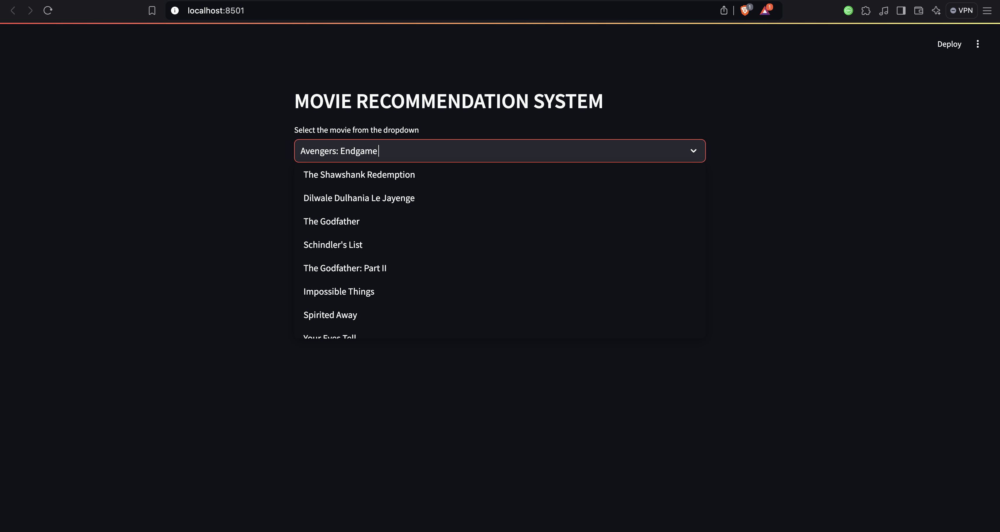
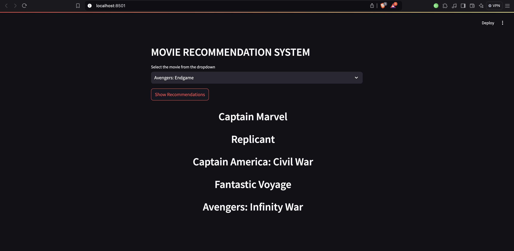

# Movie Recommendation System

## Overview

Developed a movie recommendation system using Python, Streamlit, and machine learning algorithms to provide personalized movie suggestions based on user-selected titles, leveraging natural language processing (NLP) and cosine similarity.

## Key Components

### Data Processing
- Analyzed a dataset of the top 10,000 movies from TMDB, creating a tags feature by combining genre and overview.

### Text Vectorization
- Employed `CountVectorizer` to convert text data into numerical format, optimizing features for improved accuracy.

### Similarity Calculation
- Used cosine similarity to measure relationships between movies, enabling effective recommendations.

### Interactive UI
- Built a user-friendly web application with Streamlit, allowing users to select movies and receive tailored suggestions.

### Model Optimization
- Utilized `pickle` for efficient model persistence and quick loading of data.

## Technologies Used

- Python
- Pandas
- Scikit-learn
- Streamlit
- Pickle

## Outcomes

Successfully created a personalized movie recommendation system that enhances user engagement through advanced NLP techniques.

## Screenshots

 <!-- Add your screenshot path here -->
 <!-- Add another screenshot path if necessary -->

## Drive Link
walkthrough video - https://drive.google.com/file/d/1htfduW2XX57WXb2yIgn12j-UJwYEL6pT/view?usp=sharing
